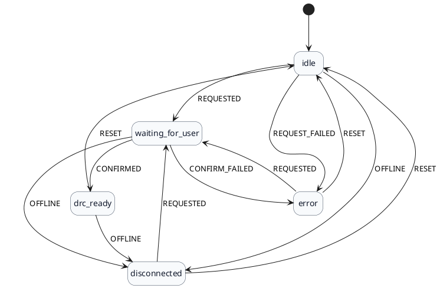

# DRC 控制状态机

本状态机描述无人机云端控制（DRC）的连接与授权流程，前后端以同一状态值对齐。

## 状态

- `idle`：尚未请求控制权。
- `disconnected`：MQTT 连接不可用或离线。
- `waiting_for_user`：已发起请求，等待遥控器确认。
- `drc_ready`：已进入 DRC 模式，可控制。
- `error`：请求或确认失败。
- `unavailable`：前端无法访问状态接口（仅前端本地状态）。

## 事件

服务端事件（核心）：

- `REQUESTED`：请求控制权成功发送。
- `REQUEST_FAILED`：请求控制权失败。
- `CONFIRMED`：遥控器确认并进入 DRC。
- `CONFIRM_FAILED`：确认失败。
- `OFFLINE`：检测到离线。
- `RESET`：服务关闭或重置。

前端事件（仅前端本地）：

- `UNAVAILABLE`：状态接口不可用。

## 状态转换图（PlantUML）

## 对齐要点

- 服务端返回 `state/last_error`，前端直接映射为 `drcState`。
- 前端仅在网络异常时使用 `unavailable` 作为本地状态，不会回写服务端。

## 集成位置

- 后端状态机：`apps/dashboard/domain/drc_state.py`
- DRC 服务：`apps/dashboard/services/drc.py`
- 前端状态机：`apps/frontend/src/components/mission/state/drcStateMachine.ts`
- 前端轮询：`apps/frontend/src/components/mission/hooks/useControlStatus.ts`
