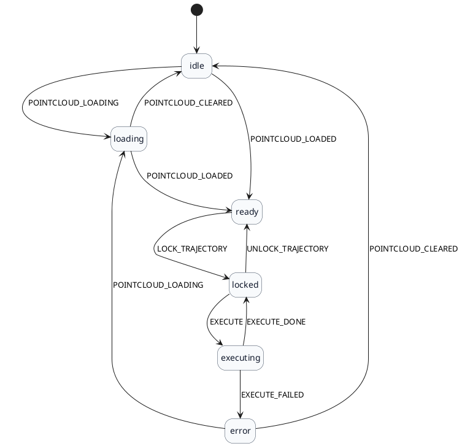
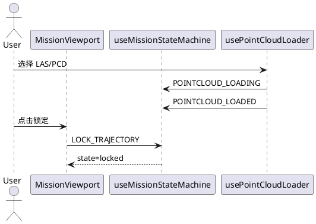

# 任务状态机

本文档描述当前任务规划 UI 使用的状态机，聚焦“点云加载/轨迹锁定/任务执行”的生命周期与集成点，便于外部接口调用时判断合法状态。

## 范围

当前状态机覆盖：

- 点云加载流程（idle/loading/ready）
- 轨迹锁定流程（ready/locked）
- 任务执行流程（locked/executing，预留）

无人机云端控制（DRC）连接状态已单独抽成状态机，详见 `doc/drc_state_machine.md`。

## 状态

- `idle`：未加载点云。
- `loading`：点云加载中。
- `ready`：点云加载完成，航点可编辑。
- `locked`：轨迹锁定，航点只读。
- `executing`：任务执行中（预留）。
- `error`：执行失败（预留）。

## 事件

内部自动触发：

- `POINTCLOUD_LOADING`：当 `isLoading === true`。
- `POINTCLOUD_LOADED`：当 `isLoading === false && hasPointCloud === true`。
- `POINTCLOUD_CLEARED`：当 `isLoading === false && hasPointCloud === false`。

用户触发：

- `LOCK_TRAJECTORY`
- `UNLOCK_TRAJECTORY`

任务执行相关（预留）：

- `EXECUTE`
- `EXECUTE_DONE`
- `EXECUTE_FAILED`

## 派生标记

- `isTrajectoryLocked`：`state === locked || state === executing`
- `canEditWaypoints`：`state === ready`

这些派生值用于统一控制航点编辑与 `/api/trajectory` 心跳发送，替代分散的布尔标记。

## 状态转换图（PlantUML）

## 锁定流程（PlantUML）

## 集成位置

- `src/components/mission/state/missionStateMachine.ts`
- `src/components/mission/MissionPlanner.tsx`

MissionPlanner 会监听 `hasPointCloud/isLoading` 并驱动状态机；所有锁定动作都由状态机处理，航点编辑逻辑统一以 `canEditWaypoints` 做 gate。

## 后续扩展建议

外部接口接入时，建议直接触发事件而不是修改 flag：

- 外部 API 锁定 -> `LOCK_TRAJECTORY`
- 外部 API 开始任务 -> `EXECUTE`
- 任务执行完成 -> `EXECUTE_DONE`
