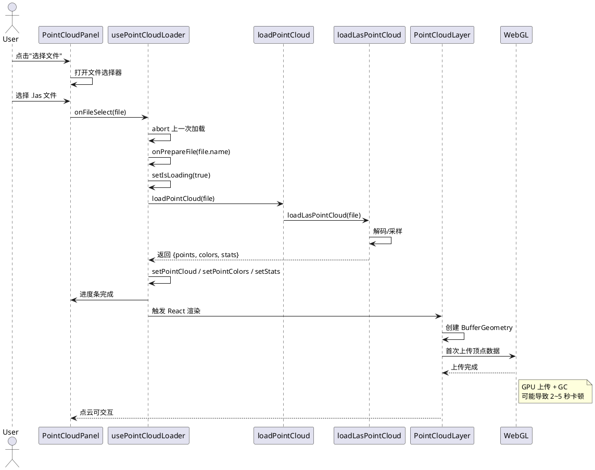
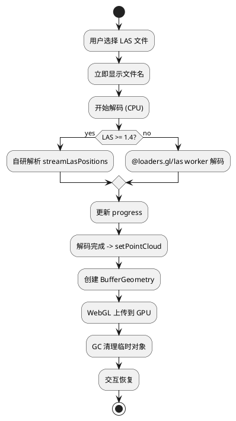
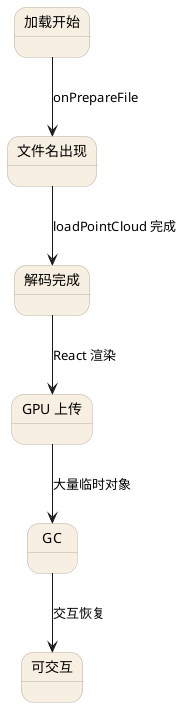

# 点云加载与渲染链路说明（LAS）

本文档描述从“打开文件选择器”到“点云可被移动/旋转”的完整事件链，并解释为什么在左上角文件名出现后仍可能出现 4~5 秒的渲染等待。文中包含 PlantUML 作为流程可视化。

## 关键结论（先读）

- **文件名出现 ≠ 点云已经完成渲染**：文件名在 `handleFileSelect` 的最开始就写入状态，渲染可能还未结束。
- 主要耗时来自三部分：
  1. LAS 解码（CPU 解析/解压）。
  2. GPU 首次上传顶点数据（WebGL 缓冲创建）。
  3. 大量临时对象释放后的 GC（垃圾回收）。
- 当前已移除 `computeBoundingSphere()` 的全量遍历，但**GPU 上传与 GC**仍可能造成几秒的“不可交互”。

---

## 事件链路概览

### 1) 入口事件：打开文件选择器

- UI 组件：`PointCloudPanel`
- 点击按钮触发 `<input type=file>` 打开文件对话框。
- 选择文件后调用 `onFileSelect(file)`。

### 2) React 处理：开始加载

- 处理逻辑：`usePointCloudLoader.handleFileSelect`
- 关键操作顺序：
  1. 终止上一次加载（`abortRef.current?.abort()`）
  2. `onPrepareFile(file.name)` → **立即更新左上角文件名**
  3. `setIsLoading(true)`，清空错误
  4. 调用 `loadPointCloud(file, options)`

### 3) 解码阶段（CPU）

- 主入口：`loadPointCloud` → `loadLasPointCloud`
- 若 LAS 新版本（>=1.4），走自研解析 `streamLasPositions`
- 否则使用 `@loaders.gl/las`：
  - `loadInBatches(..., worker: true)` 已启用 Worker
- 解码中会周期性触发 `onProgress`，用于更新 UI 进度条
- 自研解析路径已加入 `yieldToMainThread`，避免长时间阻塞主线程

### 4) React 状态更新 → 渲染

- 解码完成后：
  - `setPointCloud(Float32Array)`
  - `setPointColors(Float32Array | null)`
  - `setStats(...)`
- 触发 React 更新 → `MissionViewport` → `PointCloudLayer`

### 5) Three.js 几何创建 & GPU 上传

- `PointCloudLayer` 创建 `BufferGeometry`
  - `setAttribute('position', ...)`
  - `setAttribute('color', ...)`
  - 设置固定 `boundingSphere`（避免全量遍历）
- **首次渲染时 WebGL 将数据上传 GPU**，可能产生数秒卡顿

### 6) 可交互阶段

- 当 GPU 上传结束、GC 完成后，OrbitControls / TransformControls 才顺畅可交互
- 这就是“文件名已出现，但仍需等待几秒”的原因

---

## 代码链路参考

- UI 入口：`apps/frontend/src/components/sidebar/PointCloudPanel.tsx`
- 加载逻辑：`apps/frontend/src/lib/pointcloud/src/usePointCloudLoader.ts`
- 解码逻辑：`apps/frontend/src/lib/pointcloud/src/pointCloudLoader.ts`
- 渲染逻辑：`apps/frontend/src/components/PointCloudLayer.tsx`
- 视图容器：`apps/frontend/src/components/mission/MissionViewport.tsx`

---

## 为什么文件名出现后仍会卡？（详细解释）

1. **文件名是“立即写入”的状态**
   - 在 `handleFileSelect` 的开头就执行 `onPrepareFile(file.name)`
   - 这只是 UI 状态更新，与解码/渲染无关

2. **解码完成后还有 GPU 上传**
   - `setPointCloud` 后只是把 Float32Array 放进内存
   - WebGL 在下一次渲染时才会把数据上传到 GPU

3. **GC 延迟**
   - 解码过程中产生大量临时对象（ArrayBuffer / DataView）
   - 完成后触发 Major GC，短时间冻结主线程

---

## PlantUML：时序图（完整链路）

---

## PlantUML：活动图（含卡顿点）

---

## PlantUML：问题定位图

---

## 排查建议

1. **确认卡顿阶段**：用 Performance 录制，观察是否出现长时间 GC 或 WebGL 任务。
2. **降低点云数据量**：调小 `UI_CONFIG.pointCloud.budgetMB` 可快速验证。
3. **先禁用颜色**：颜色数组会显著增加 GPU 上传成本。

---

## 可选优化方向

- 把自研 LAS 解析也放到 Worker
- 将 GPU 上传拆批（分块渲染）
- 加入“低清晰预览 → 完整加载”的两阶段模式
